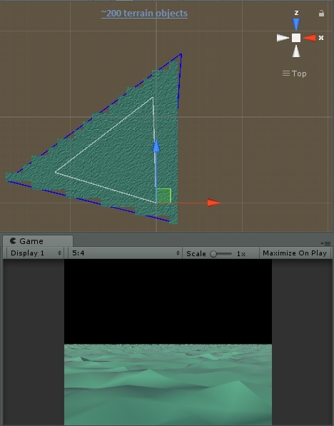

# Unity-FOV-Terrain-Generator
Generates endless terrain based on camera fov

### Getting Started

Project made with Unity 2018.2.04b 

The scripts should be able to be taken out and used with any version of unity though.

The generator scripts are in the **fovTerrainGenerator** folder.

In the components folder is the **TerrainStreamer** component. Put this on any game object and add a camera and a Terrain or TerrainObject prefab as the terrain.

In the **classes** folder is **TerrainsInTriangle** <- this is where the main calculations happen. 

If you have any suggestions of ways to optimize, let me know.

Enjoy!